# 11-UFOs
Module 11 - UFOs sightings with JavaScript

## Project/Challenge Overview
We've been tasked to create a webpage that displays and filters through a table of UFO sightings.

## Resources
- VS Code, HTML5, JavaScript, CSS, D3, Bootstrap 4
- data.js containing javascript object of all the sightings

## Overview
Using Javascript, Bootstrap, and D3, at the end of the module, we created the UFO sightings page, with a nav bar, a jumbotron, a title and article, and the table of sightings that we can filter by date (by entering it).

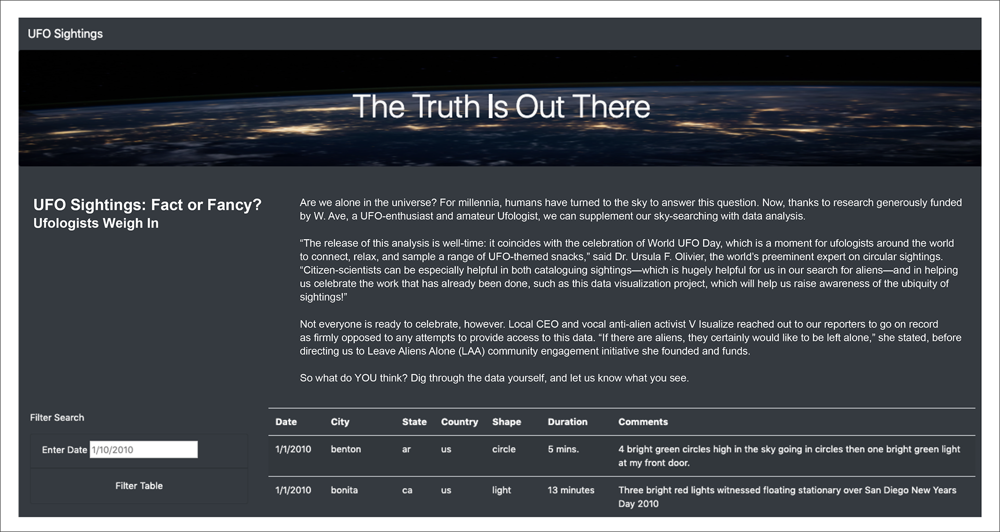

For the challenge, we've been tasked to add a filter for each Date - City - State - Country - Shape.

- step 1: Adding 4 similar input filters that are called together.
    - adding 4 "label-input-id" tags for each in index.html
    - replacing the function handleClick() by updateFilters(), in app.js, that uses d3 to read each input to create the filters to filter the data
    - creating the function filterTable() that filters the data and writes it in the HTML code, using a switch/case statement
 
 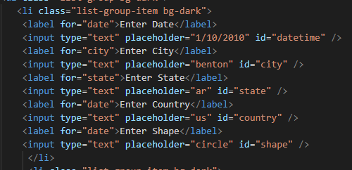 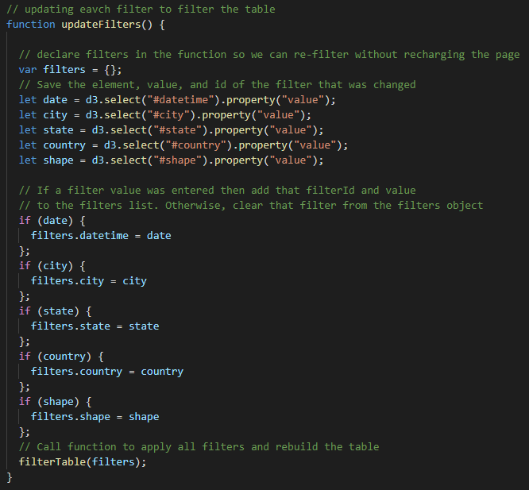 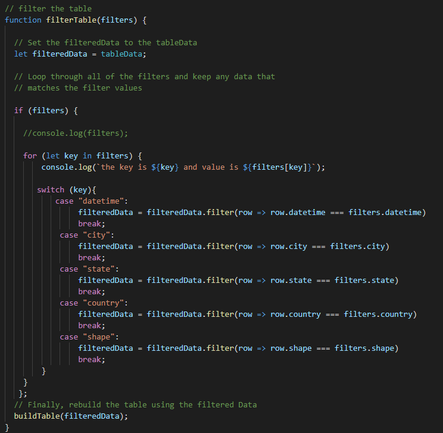
 
 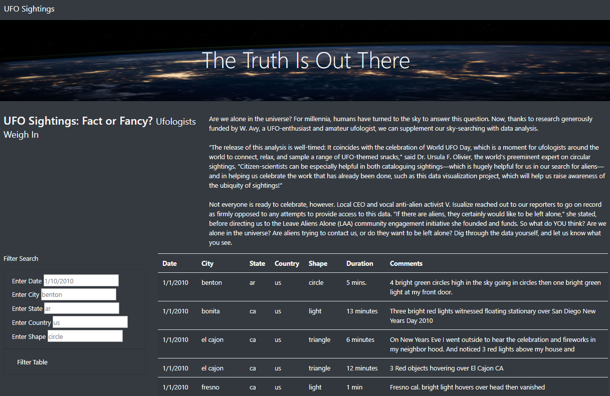
 
 - step 2: with these input filters, we're at the risk of mispelling or formatting differently each input, so we replaced them by more user-friendly dropdowns lists
     - we replaced the "input-label" tags for each filter by a select tag, keeping the same id
     - in app.js, we first created 5 empty lists that will populate each filter (by "select" tag and id)
     - the function buildLists() then builds each list, by looping through the javascript opbject data, by adding each new date/city/state/country/shape
     - the function buildFilter() then populates each dropdown list by looping through each list
     
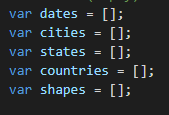 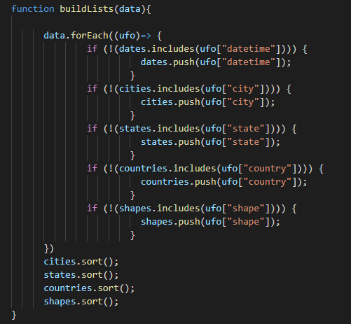 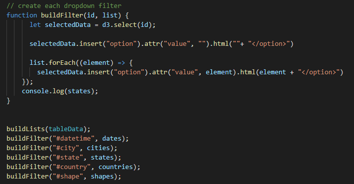  

- step 3: for a more user-frienly approach, we added a filter button to each filter, while keeping the "Filter All" button. So it's possible to filter by each filter directly, or one after the other, or all together. We also added a reset button to each filter to reset each filter (and table), and a "Reset All" button to reset all (without having to click in the nav bar). 

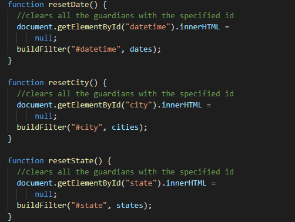 

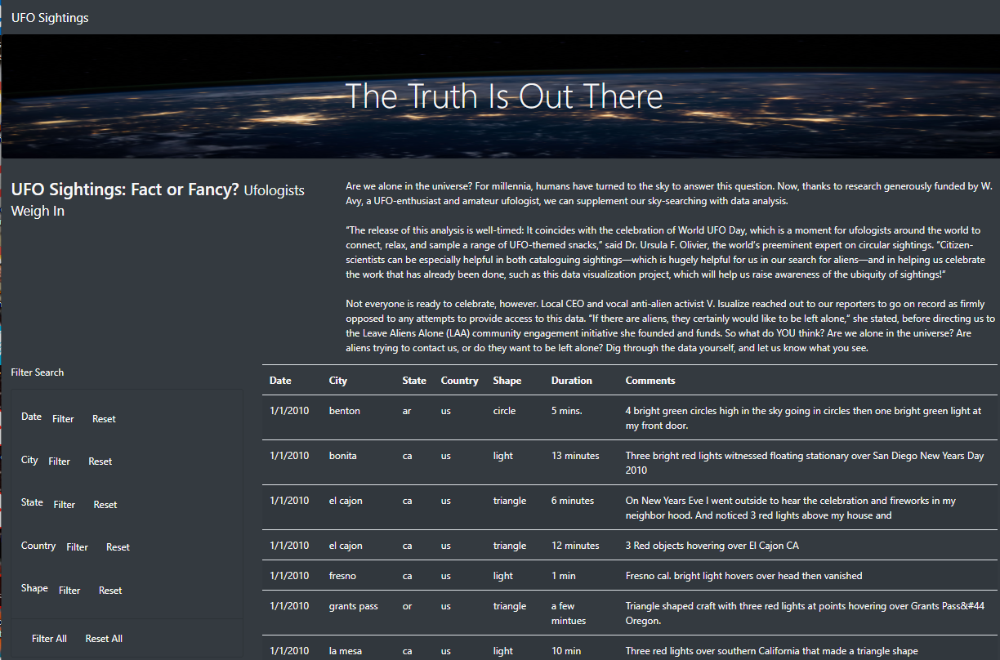 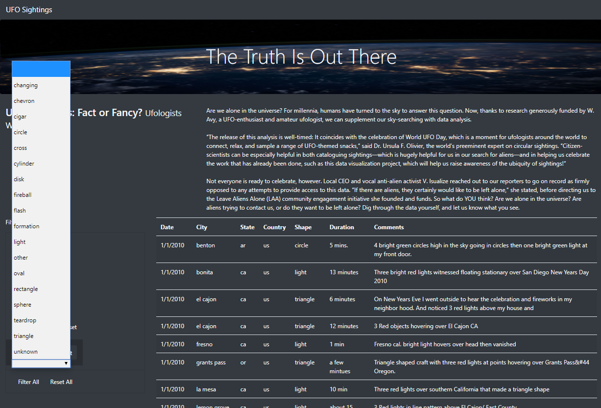

- Further Development:
      - update with more user-friendly (and nicer) dropdown lists that can autofill (and link the Country-State-City filters) 
      - replace the Date dropdown list by a date selector
      - giving the choice between 3 visualizations:
                - showing the sightings in a table
                - showing the sightings in a calendar
                - showing the sightings on a map

  
 
 
 
 
 

                            

